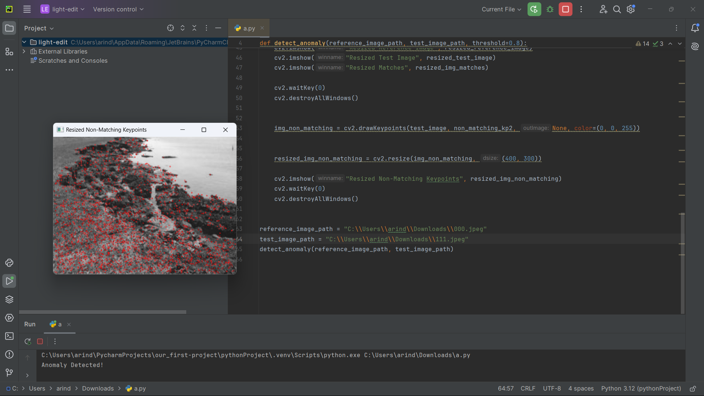

# AI-anomaly-detection
AI BASED DRONE APPLICATION IN CATCHMENT AREA 

```py
import cv2
import numpy as np

def detect_anomaly(reference_image_path, test_image_path, threshold=0.8):
    
    reference_image = cv2.imread(reference_image_path, cv2.IMREAD_GRAYSCALE)
    test_image = cv2.imread(test_image_path, cv2.IMREAD_GRAYSCALE)

   
    sift = cv2.SIFT_create()
    kp1, des1 = sift.detectAndCompute(reference_image, None)
    kp2, des2 = sift.detectAndCompute(test_image, None)

    
    bf = cv2.BFMatcher()
    matches = bf.knnMatch(des1, des2, k=2)

    
    good_matches = []
    for m, n in matches:
        if m.distance < 0.75 * n.distance:
            good_matches.append(m)

    non_matching_kp1 = [kp1[m[0].queryIdx] for m in matches if m[0] not in good_matches]
    non_matching_kp2 = [kp2[m[0].trainIdx] for m in matches if m[0] not in good_matches]

    
    anomaly_score = 1 - len(good_matches) / len(kp1)

    
    if anomaly_score > threshold:
        print("Anomaly Detected!")
    else:
        print("No Anomaly Detected.")

    
    img_matches = cv2.drawMatches(reference_image, kp1, test_image, kp2, good_matches, None)

    
    resized_reference_image = cv2.resize(reference_image, (400, 300))
    resized_test_image = cv2.resize(test_image, (400, 300))
    resized_img_matches = cv2.resize(img_matches, (800, 600))

   
    cv2.imshow("Resized Reference Image", resized_reference_image)
    cv2.imshow("Resized Test Image", resized_test_image)
    cv2.imshow("Resized Matches", resized_img_matches)
    
    cv2.waitKey(0)
    cv2.destroyAllWindows()

    
    img_non_matching = cv2.drawKeypoints(test_image, non_matching_kp2, None, color=(0, 0, 255))

    
    resized_img_non_matching = cv2.resize(img_non_matching, (400, 300))

    cv2.imshow("Resized Non-Matching Keypoints", resized_img_non_matching)
    cv2.waitKey(0)
    cv2.destroyAllWindows()


reference_image_path = "C:\\Users\\arind\\Downloads\\000.jpeg"
test_image_path = "C:\\Users\\arind\\Downloads\\111.jpeg"
detect_anomaly(reference_image_path, test_image_path)

```
--- 

<div style="display: flex; justify-content: center;">
    
    
</div>


<h1>EXPLANATION</h1>

This Python code is for detecting anomalies between two images using the Scale-Invariant Feature Transform (SIFT) algorithm. Here's a breakdown of how it works:

1. **Import Libraries**: The code imports necessary libraries, OpenCV (`cv2`) for computer vision operations and NumPy (`np`) for numerical operations.

2. **`detect_anomaly` Function**: This function takes two image paths (`reference_image_path` and `test_image_path`) as input along with an optional threshold parameter (default set to 0.8). It performs the following steps:

    a. **Read Images**: Reads the reference and test images in grayscale mode using `cv2.imread()`.

    b. **SIFT Feature Extraction**: Uses the SIFT algorithm to detect keypoints (`kp1` and `kp2`) and compute descriptors (`des1` and `des2`) for both images.

    c. **Feature Matching**: Matches the descriptors between the reference and test images using a Brute-Force Matcher (`bf`). It finds the best matches (`good_matches`) by comparing distances between the nearest and second-nearest neighbor matches.

    d. **Anomaly Score Calculation**: Calculates the anomaly score based on the ratio of the number of good matches to the total number of keypoints in the reference image.

    e. **Anomaly Detection**: Compares the anomaly score with the threshold. If the score is greater than the threshold, it prints "Anomaly Detected!", otherwise, it prints "No Anomaly Detected."

    f. **Visualizing Matches**: Draws the matching keypoints between the reference and test images using `cv2.drawMatches()` and displays the result.

    g. **Visualizing Non-Matching Keypoints**: Draws the non-matching keypoints from the test image and displays the result. Non-matching keypoints are those that do not have a corresponding good match in the reference image.

3. **Image Paths and Function Call**: Defines paths to the reference and test images and calls the `detect_anomaly` function with these paths.

4. **Explanation Request**: The code ends with a request for an explanation, possibly for further clarification or understanding of the code.

This code essentially compares two images based on their keypoint features and identifies if there are any significant anomalies between them. Anomalies could include changes in perspective, object presence or absence, or other alterations.

<h1>OUTPUT</h1>


<div style="display: flex; justify-content: center;">
    
    
    
</div>
